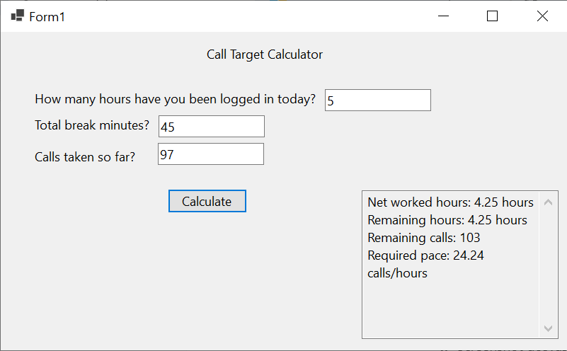

# Call Target Calculator — C# WinForms


The desktop GUI implementation of the Call Target Calculator, built with C# and Windows Forms.

This version adapts the original Java console application's calculation logic to an event-driven graphical interface.

## Features

### Input

* Logged-in hours
* Break minutes
* Calls taken so far

### Calculates

* Net worked hours
* Remaining working hours
* Remaining calls
* Required calls per hour

Additional features include:

* Input validation with user-friendly error messages
* Read-only structured output
* Target-completed handling
* Windows Forms graphical interface

## Core Calculation Logic

The application currently uses:

```text
Daily target: 200 calls
Daily net working time: 8.5 hours
```

Calculation:

```text
Net worked hours =
    Login hours - (Break minutes / 60)

Remaining net hours =
    Daily net hours - Net worked hours

Remaining calls =
    Daily target - Calls taken

Required pace =
    Remaining calls / Remaining net hours
```

## Tech Stack

* C#
* .NET 8
* Windows Forms (WinForms)

## Project Structure

```text
csharp-winforms/
├── CallTargetCalculatorGUI.slnx
├── CallTargetCalculatorGUI/
├── images/
└── README.md
```

## Application Screenshot

<p align="center">
  
  <br/>
  <em>Call Target Calculator — C# WinForms</em>
</p>

## Purpose

The main goal of this implementation was to take the business logic from the original Java console application and adapt it to a desktop GUI environment.

This provided practice with:

* Event-driven programming
* Windows Forms controls
* Form-based user input
* Input validation
* Translating logic between Java and C#
* Desktop application development

## Design

The application uses Windows Forms controls for input and output.

User input is validated using:

* `double.TryParse`
* `int.TryParse`

The calculation is triggered through a button click event, demonstrating the transition from sequential console execution to event-driven application flow.

## What I Learned

Through this implementation I practiced:

* Creating Windows Forms applications
* Wiring controls to event handlers
* Handling graphical user input
* Providing validation feedback with `MessageBox`
* Working with the WinForms Designer
* Translating existing Java logic into C#
* Debugging GUI-related issues

## Current Limitations

The application intentionally keeps the calculation model simple.

Current limitations include:

* Fixed daily target
* Fixed daily net working hours
* No persistent data storage
* Calculation logic currently resides in the form event handler
* No automated tests

## Possible Improvements

Future improvements could include:

* Extract calculation logic into a separate service class
* Add unit tests with xUnit or NUnit
* Make the daily target configurable
* Make shift length configurable
* Improve UI layout and spacing
* Add additional desktop UI features

## Other Implementations

This project is also implemented as:

* **Java Console** — [`../java-console`](../java-console)
* **Web Application** — [`../web`](../web)

All implementations are maintained together in the main **Call Target Calculator** repository.
