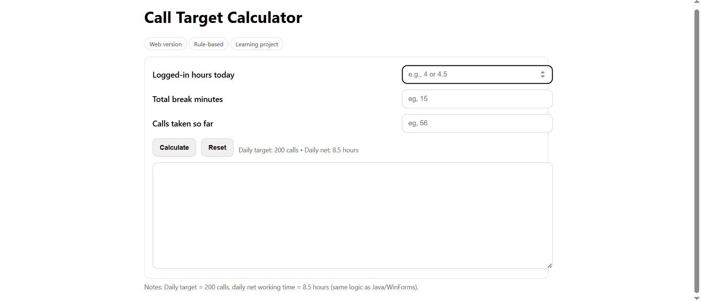

# Call Target Calculator — Web


The browser-based implementation of the Call Target Calculator, built with pure HTML, CSS, and Vanilla JavaScript.

This version adapts the same core calculation logic used in the Java console and C# WinForms implementations to a browser environment.

## Features

### Input

* Logged-in hours
* Break minutes
* Calls taken so far

### Calculates

* Net worked hours
* Remaining net hours
* Remaining calls
* Required calls per hour

Additional features include:

* Client-side input validation
* Support for both `4.5` and `4,5` number formats
* Target-completed handling
* Reset button
* Enter-key calculation
* Fully client-side execution
* No backend required

## Core Calculation

The application currently uses:

```text
Daily target: 200 calls
Daily net working time: 8.5 hours
```

Calculation:

```text
Net worked hours =
    Login hours - (Break minutes / 60)

Remaining net hours =
    Daily net hours - Net worked hours

Remaining calls =
    Daily target - Calls taken

Required pace =
    Remaining calls / Remaining net hours
```

## Tech Stack

* HTML5
* CSS3
* Vanilla JavaScript

No frameworks, external libraries, or build tools are required.

## Project Structure

```text
web/
├── index.html
├── images/
└── README.md
```

## Application Screenshot

<p align="center">
  
  <br/>
  <em>Call Target Calculator — Web Version</em>
</p>

## Purpose

The goal of this implementation was to take the same calculation logic used in the earlier versions and adapt it to a browser-based interface.

This version provided practice with:

* DOM manipulation
* Event listeners
* Client-side validation
* Numeric parsing
* Browser-based user interfaces
* Static web application structure

## Design

The application runs entirely in the browser.

The interface collects user input through HTML form controls and uses JavaScript to validate values, perform the calculation, and update the output dynamically.

Special handling is included for:

* Invalid input
* Decimal values
* Reaching or exceeding the target
* Having no remaining working time

## What I Learned

Through this implementation I practiced:

* Connecting HTML elements to JavaScript logic
* Working with `addEventListener`
* Parsing and validating numeric input
* Updating the DOM dynamically
* Handling user interaction in the browser
* Translating existing Java and C# logic into JavaScript
* Structuring a small static web application

## Current Limitations

The application intentionally keeps the calculation model simple.

Current limitations include:

* Fixed daily target
* Fixed daily net working hours
* No persistent settings
* HTML, CSS, and JavaScript are currently kept in a single file
* No automated tests

## Possible Improvements

Future improvements could include:

* Make the daily target configurable
* Make shift length configurable
* Split HTML, CSS, and JavaScript into separate files
* Add localStorage support
* Add automated tests
* Improve responsive layout
* Add optional themes or dark mode

## Other Implementations

This project is also implemented as:

* **Java Console** — [`../java-console`](../java-console)
* **C# WinForms** — [`../csharp-winforms`](../csharp-winforms)

All implementations are maintained together in the main **Call Target Calculator** repository.
